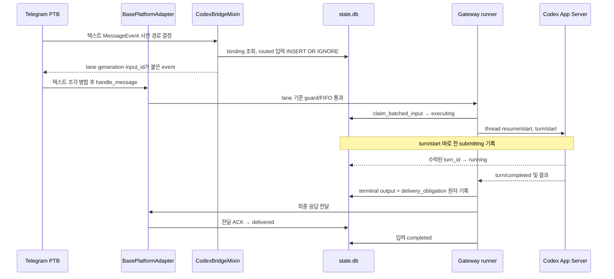
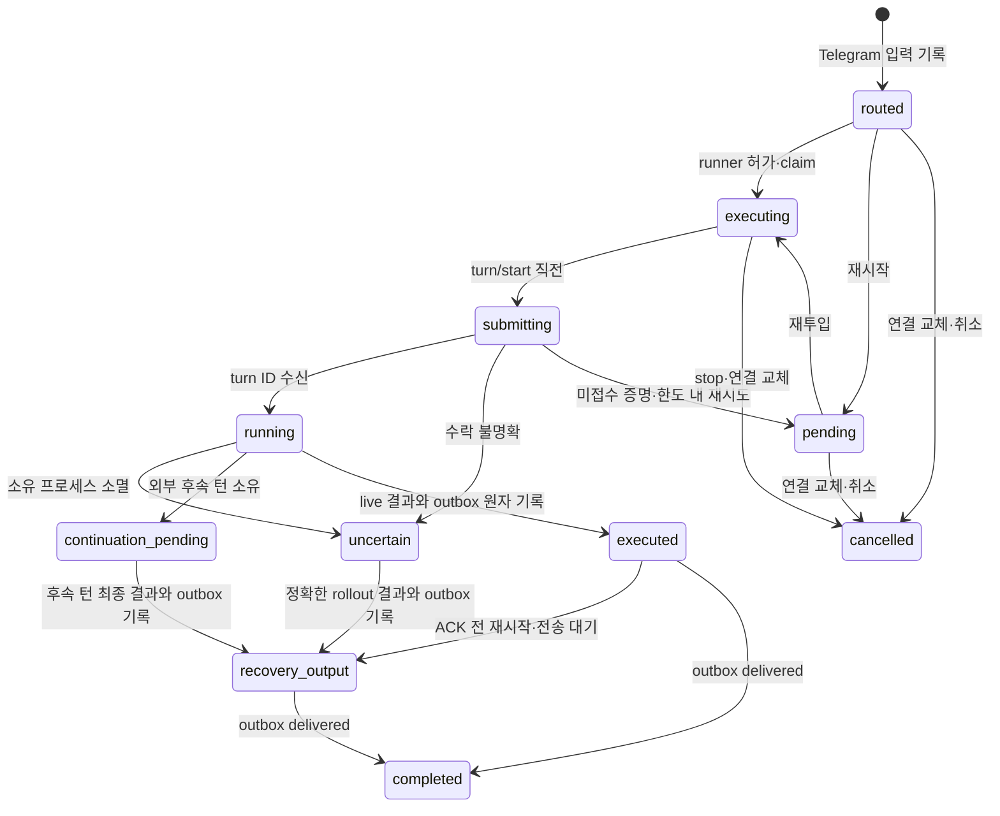

# Hermes Telegram ↔ Codex 브리지 실행·상태 흐름

- 검증한 소스 커밋: `a9fa345032a6dfd9805fc6ddd0296f80d818c89c`
- 대상과 범위는 [구조 개요](overview.md)를 따른다. 관심 경로만 읽고 상세 변경 줄은 [장부](coverage.tsv)에서 찾는다.

## 실제 경로를 따라 읽은 결과

### 1. 바인딩과 명령

`/codex_session`의 정식 이름은 `codex-session`이고 `/codex_model`은 `codex-model`의 별칭이다. `hermes_cli/commands.py`가 명령과 별칭을 등록하고 `gateway/run_busy.py`의 idle handler 목록이 mixin의 `_handle_codex_session_command`, `_handle_codex_model_command`, `_handle_ns_command`를 찾는다. 세 명령 모두 Telegram 개인 대화만 허용한다. `catalog.py`는 공식 app-server `thread/list`, `thread/turns/list`, `thread/items/list`를 페이지 단위로 읽고 중복 thread 행을 합친다. 가능한 경우 데스크톱 control socket을 먼저 사용한다. `/ns`는 최근 세션의 실제 `cwd` 중 존재하는 프로젝트를 보여 준다. 근거: [`hermes_cli/commands.py`](../../hermes_cli/commands.py), [`gateway/run_busy.py`](../../gateway/run_busy.py), [`gateway/codex_bridge/catalog.py`](../../gateway/codex_bridge/catalog.py), [`gateway/codex_bridge/mixin.py`](../../gateway/codex_bridge/mixin.py).

선택한 기존 세션은 `store.bind()`로 새 generation을 받고, 기존 연결을 다시 선택하면 generation은 유지하면서 `restart_mirror()`로 표시용 커서와 progress를 재시작한다. 연결 해제는 `unbind()`, `/ns`는 임시 thread ID로 `pending_new`를 기록하고 첫 `turn/start` 성공 후 `promote_pending()`으로 실제 thread ID로 바꾼다. `/codex_model`은 현재 binding에 model/effort를 한 쌍으로 CAS 갱신하며 다음 턴부터 적용한다. 선택 버튼은 Telegram 어댑터에서 `(chat_id, bot_message_id)`별로 관리하고 10분 후 만료되며, 중복 선택은 콜백 실행 전 상태를 제거해서 막는다. 근거: [`gateway/codex_bridge/store.py`](../../gateway/codex_bridge/store.py), [`plugins/platforms/telegram/adapter.py`](../../plugins/platforms/telegram/adapter.py).

### 2. 일반 Telegram 입력

Telegram 텍스트 업데이트는 `_handle_text_message`가 `_prepare_session_route`를 기다린 뒤 버퍼에 넣는다. 이때 인증된 Telegram DM이며 활성 바인딩이 있을 때만 `_resolve_codex_bridge_route`가 lane을 만들고 SQLite의 `routed` 행을 기록한다. 연결되지 않은 DM 및 다른 플랫폼은 기존 Hermes 경로로 간다. 명령은 control source에 남고 Codex 입력 행으로 만들지 않는다. DB 오류 시 공용 어댑터가 오류를 사용자에게 보내고 Hermes 일반 세션으로 실행하지 않는다. 근거: [`plugins/platforms/telegram/adapter.py`](../../plugins/platforms/telegram/adapter.py), [`gateway/platforms/base.py`](../../gateway/platforms/base.py), [`gateway/codex_bridge/mixin.py`](../../gateway/codex_bridge/mixin.py).

대기 중인 입력은 공용 adapter guard와 runner FIFO를 지나며, 브리지 입력은 generic busy 설정과 관계없이 `queue`를 쓴다. 텍스트 조각 여러 개가 하나의 지시로 합쳐지면 `codex_bridge_batched_input_ids`를 보존하고 `claim_batched_input`이 대표 입력을 `executing`으로, 나머지를 `cancelled`로 한 트랜잭션에서 처리한다. 인증·일시정지·플러그인·동시 실행 제한 등을 지난 후에만 실행 소유권을 잡는다. `gateway/run_turn.py`는 bridge metadata를 `TurnContext`로 넘기고, `TurnRunner`는 해당 lane의 runtime을 `codex_app_server`로 강제한다. 근거: [`gateway/run_inbound.py`](../../gateway/run_inbound.py), [`gateway/run_busy.py`](../../gateway/run_busy.py), [`gateway/platforms/base.py`](../../gateway/platforms/base.py), [`gateway/run_turn.py`](../../gateway/run_turn.py), [`gateway/run_turn_runner.py`](../../gateway/run_turn_runner.py).

`_configure_codex_bridge_agent`는 현재 generation을 재확인하고 resume thread, 전체 액세스 정책, `clientUserMessageId=input_id`, 모델·추론 설정, 턴 시작 전후 콜백을 AIAgent에 설치한다. `CodexAppServerSession`은 같은 thread를 겨냥한 Hermes writer를 잠그고, 진행 중인 데스크톱 턴이 있으면 그 턴을 조종하거나 중단하지 않고 완료 경계를 기다린다. `turn/start` 기록 직전에 `submitting`, 응답에서 turn ID를 받으면 `running`이다. 전송 전에 실패한 것으로 증명된 경우에만 제한적으로 재시도하고, 수락 여부가 불명확하면 `uncertain`으로 둔다. 근거: [`gateway/codex_bridge/mixin.py`](../../gateway/codex_bridge/mixin.py), [`agent/transports/codex_app_server_session.py`](../../agent/transports/codex_app_server_session.py), [`agent/codex_runtime.py`](../../agent/codex_runtime.py).

### 3. 최종 출력과 중간 보고

app-server `item`은 projector가 메시지로 변환한다. `commentary`는 interim 경로, 명시적 `final_answer`와 확인된 `turn/completed`는 최종 결과 경로다. 상태 없는 구버전 메시지는 terminal candidate로만 보관하고 완료 상태가 확인될 때 승격한다. `CodexAppServerSession`은 턴 범위가 다른 알림과 승인 요청을 차단하고, 활동이 있는 동안 inactivity deadline을 갱신한다. 종료 이벤트가 빠지면 해당 턴을 `thread/read`로 재확인한다. 브리지 턴 후에는 app-server 세션을 닫아 writer를 풀어 준다. 근거: [`agent/transports/codex_event_projector.py`](../../agent/transports/codex_event_projector.py), [`agent/transports/codex_app_server_session.py`](../../agent/transports/codex_app_server_session.py), [`agent/codex_runtime.py`](../../agent/codex_runtime.py).

게이트웨이는 결과의 turn ID, 오류, 전송 불확실성 신호를 보존한다. `_codex_bridge_finalize_input`은 ReloginTool의 정확한 handoff가 소유권을 가진 경우 입력을 `continuation_pending`으로 넘긴다. 그렇지 않으면 최종 텍스트와 `delivery_obligations` 행을 같은 SQLite 트랜잭션에 쓰고, adapter가 그 ID로 send를 claim한다. 플랫폼 ACK 후에만 입력을 `completed`로 닫는다. 이미 성공적으로 스트리밍한 최종 답변은 장부에 ACK를 맞춘다. `delivery_ledger.py`는 의미상 동일 출력에 안정적인 ID를 부여하고 `pending → attempting → delivered/failed`를 관리하며, 소진된 행은 `manual_review`로 남긴다. 확정된 턴 상태 필드는 `TurnRunner`를 거쳐 최종 출력 판정까지 전달된다. 근거: [`gateway/codex_bridge/mixin.py`](../../gateway/codex_bridge/mixin.py), [`gateway/codex_bridge/store.py`](../../gateway/codex_bridge/store.py), [`gateway/platforms/base.py`](../../gateway/platforms/base.py), [`gateway/delivery_ledger.py`](../../gateway/delivery_ledger.py).

### 4. 데스크톱 턴의 Telegram 반영

watcher는 바인딩별 rollout 파일을 찾되 Codex state DB, 힌트, 파일 검색 순서로 후보를 좁히고 첫 `session_meta.payload.id`가 정확히 같은 파일만 받는다. `RolloutTail`은 JSONL의 완전한 줄만 읽고 `user`, `commentary`, `final`, `error` 이벤트와 byte offset을 만든다. 파일 교체·축소를 감지하고 상태를 재구성한다. 손상된 완전한 줄은 두 번 재시도하고 세 번째에 오류 이벤트로 격리한다. 사용자 작성 여부, client ID, physical turn, 명시적 predecessor→successor edge를 이용해 입력 출처를 가린다. 근거: [`gateway/codex_bridge/rollout.py`](../../gateway/codex_bridge/rollout.py), [`gateway/codex_bridge/handoff.py`](../../gateway/codex_bridge/handoff.py).

watcher의 판정은 `claim_rollout_event`의 `unmanaged/live/rollout/terminal/wait`다. 데스크톱 소유 이벤트는 `unmanaged`로 Telegram에 새 진행·최종 메시지를 비추고, 복구된 Telegram 입력은 `rollout` 소유로 원래 입력 결과를 완성한다. live runner나 이미 완료된 입력은 중복 미러링을 억제한다. `wait`이면 커서를 전진시키지 않고 다음 poll에서 다시 읽는다. Progress는 작은 카드로 분할하여 DB에 먼저 저장하고 outbox로 전송한다. final intent를 저장하면 관련 progress를 동결한다. 근거: [`gateway/codex_bridge/mixin.py`](../../gateway/codex_bridge/mixin.py), [`gateway/codex_bridge/store.py`](../../gateway/codex_bridge/store.py).

### 5. 재시작, 취소, 프로필 전환

`recover_after_restart`는 기존 프로세스의 PID와 시작 시간을 확인한다. 전송 전 `routed/admitted/executing`은 재처리 가능한 `pending`, 전송 중 `submitting/running`은 중복 실행을 막는 `uncertain`, 출력이 만들어진 `executed`는 전송만 복구하는 `recovery_output`으로 전이한다. watcher가 `recoverable_inputs`를 adapter에 다시 넣고 `recoverable_outputs`의 정확한 obligation을 재전송한다. 기존 generic `resume_pending`은 브리지 lane에 새 사용자 지시를 만들 수 있어 startup/shutdown에서 억제·정리한다. 근거: [`gateway/codex_bridge/store.py`](../../gateway/codex_bridge/store.py), [`gateway/codex_bridge/mixin.py`](../../gateway/codex_bridge/mixin.py), [`gateway/run_startup.py`](../../gateway/run_startup.py), [`gateway/run_shutdown.py`](../../gateway/run_shutdown.py).

`/stop`은 현재 lane의 Telegram 입력을 취소하고 Hermes가 소유한 turn만 중단한다. 데스크톱에서 이미 실행 중인 foreign turn을 기다리는 동안에는 해당 turn에 `turn/interrupt`를 보내지 않는다. `/codex_session` 교체·해제와 `/ns`는 generation을 올려 예전 대기 입력을 취소한다. `handoff.py`는 ReloginTool의 상태 파일에서 정확한 predecessor→successor와 상태만 읽는다. 준비 중인 handoff는 임의의 다음 턴을 후계자로 확정하지 않는다. 상태 파일 생산 방식 자체는 이번 범위 밖이다. 근거: [`gateway/slash_commands.py`](../../gateway/slash_commands.py), [`gateway/run_busy.py`](../../gateway/run_busy.py), [`agent/transports/codex_app_server_session.py`](../../agent/transports/codex_app_server_session.py), [`gateway/codex_bridge/handoff.py`](../../gateway/codex_bridge/handoff.py).

## 영속 상태와 판정 기준

| 항목 | 키·대표 값 | 의미 |
| --- | --- | --- |
| `codex_bridge_bindings` | control session key, thread ID, generation, pending_new, rollout cursor, model/effort | Telegram 대화가 선택한 Codex 세션과 현재 권한 |
| `codex_bridge_inputs` | input ID, lane key, generation, physical turn ID, scheduler `state` | Telegram 지시의 내구 기록과 실행 단계 |
| 입력의 독립 의미 필드 | `delivery_owner`, `physical_turn_status`, `logical_input_status`, `output_kind`, `delivery_status` | 물리적 턴 종료와 논리적 지시 완료 및 Telegram 전달을 혼동하지 않기 위한 분리 |
| `codex_bridge_progress` | control key + generation + logical turn ID | rollout commentary를 먼저 저장하고 나중에 보내는 카드 |
| `delivery_obligations` | semantic obligation ID, logical key, output kind, state | 최종 답변·진행·오류 공통 전달 장부 |
| rollout cursor | path + device + inode + byte offset + last event ID | 같은 파일 incarnation에서 어디까지 안전하게 처리했는지 |
| handoff JSON | thread + interrupted turn → continued turn | 외부 프로필 전환이 보증한 정확한 후계 관계 |

`inputs.state`의 주요 경로는 `routed → executing → submitting → running → executed → completed`다. `pending`은 재실행 대기, `uncertain`은 전송 수락 여부 조사, `continuation_pending`은 외부 후속 턴 대기, `recovery_output`은 출력 전달 대기, `cancelled`는 취소다. `completed`는 Codex가 답한 순간이 아니라 정확한 outbox 행이 `delivered`가 된 뒤다. `delivery_obligations.attempting`은 플랫폼 ACK가 애매할 수 있어 무표시 자동 중복 전송을 허용하지 않는다.

## 턴 상태 전달 확인

`run_codex_app_server_turn()`의 `codex_turn_status`와 `codex_turn_status_confirmed`는 `TurnRunner.run_sync()`의 공통 결과에 보존된다. `gateway/run_turn.py`가 그 결과를 이벤트의 `_codex_bridge_agent_result`로 넘기고, `_codex_bridge_finalize_input()`은 확인된 `completed`를 `final_answer`로 stage한다. 이 전달 경로는 `a9fa345032`에서 수정되었고 `tests/gateway/test_turn_context.py`의 회귀 테스트가 완료·실패 상태 전달을 확인한다. 이는 소스와 해당 테스트의 결론이며 운영 DB·Telegram 도착 증거는 아니다. 근거: [`agent/codex_runtime.py`](../../agent/codex_runtime.py), [`gateway/run_turn_runner.py`](../../gateway/run_turn_runner.py), [`gateway/run_turn.py`](../../gateway/run_turn.py), [`gateway/codex_bridge/mixin.py`](../../gateway/codex_bridge/mixin.py).
