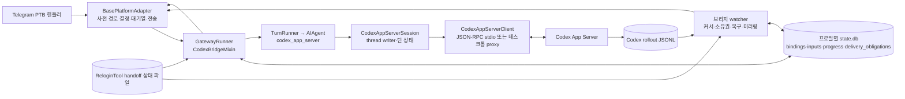

# Hermes Telegram ↔ Codex 브리지 구조

- 검증한 소스 커밋: `a9fa345032a6dfd9805fc6ddd0296f80d818c89c`
- upstream 공통 기준점: `a6102b8d809d6b32824757b547b60f9d22d6a88e`
- 범위: 기준점부터 위 검증 커밋까지 `mkcount`으로 기록된 27개 커밋의 비테스트 변경 30개 파일, 추가 6,062줄·삭제 230줄. Git 작성자 정보는 직접 타이핑한 사람의 증거가 아니다.
- 읽기 기준: 새 브리지 6개 파일 전체와 기존 파일의 변경 줄·호출·반환 경로. ReloginTool 저장소 내부와 테스트 파일은 구조 장부에서 제외했다. 테스트는 수정 검증에 별도로 사용할 수 있다.
- [줄·함수 장부](coverage.tsv)는 현재 파일의 추가 줄 6,062개를 빠짐없이 연결한다. 삭제 줄에는 현재 줄 번호가 없다. 자세한 실행·상태 경로는 [흐름 문서](flows.md)에 있다.
- 이 문서는 소스 구조를 설명한다. 운영 프로세스·배포 상태·실제 Telegram 전달 여부는 별도 확인이 필요하다.

## 전체 관계도

핵심 구분은 **Telegram 대화의 control session**, **선택한 Codex thread의 실행 lane**, **Codex 물리적 turn**, **입력 하나의 논리적 완료**, **Telegram 전달 의무**다. 이 다섯 항목은 같은 ID나 같은 상태가 아니다. `SessionSource.trusted_local_lane`은 세션 키를 분리하지만 `to_dict()`에 직렬화되지 않는다. 브리지 DB의 `generation`은 `/ns`나 다른 세션 선택으로 바인딩이 교체될 때 이전 입력·진행의 권한을 끊는다. 근거: [`gateway/session.py`](../../gateway/session.py), [`gateway/codex_bridge/store.py`](../../gateway/codex_bridge/store.py), [`gateway/codex_bridge/mixin.py`](../../gateway/codex_bridge/mixin.py).

## 파일별 역할

새 브리지 6개 파일의 함수·메서드는 다음처럼 묶어 읽었다. 각 묶음의 변경 줄은 `coverage.tsv`에서 확인할 수 있다.

| 파일 | 함수·메서드와 역할 |
| --- | --- |
| `gateway/codex_bridge/__init__.py` | 공개 binding/store 타입만 재노출하는 패키지 경계 |
| `catalog.py` | `_normalized_turn_status`, `_normalized_error_code`, `_thread_replay`: 저장된 turn/items를 재생 프레임·최종 상태로 환원. `_thread_summary`, `_unique_thread_summaries`: picker용 중복 thread·제목 정리. `_list_thread_rows`, `_paged_data`, `_read_thread_turns`: 공식 API 페이징과 후계 턴 체인 조회. `list_recent_threads`, `read_thread_replay`, `list_recent_projects`: 사용자 선택·연결 시 조회 |
| `handoff.py` | `CodexTurnHandoff`: handoff가 입력 소유권을 이어야 하는지 판단. `CodexHandoffGraph`: successor·pending 조회. `_read_handoffs`: JSON 파일 mtime/size 캐시 및 파싱. `read_thread_handoff_graph`, `read_turn_handoff`: 정확한 thread/turn 일치와 append-only 후계 체인 제공 |
| `rollout.py` 앞부분 | `_codex_home`, `resolve_rollout_path`: 안전한 파일 탐색·session ID 검증. `_aligned_tail_start`, `_content`, `_client_id`, `_error_code`, `_is_user_authored`: JSONL 필드·출처 해석 |
| `rollout.py` tail 수명 | `RolloutTail.__init__`, `set_handoff_graph`, `_reset_for_replacement`, `_record_time`, `_prime`, `prime_full`, `_prime_range`, `scan`: 커서·파일 incarnation·초기 이력·완전한 줄 처리 |
| `rollout.py` 이벤트 해석 | `_defer_for_unbound_successor`, `_event`, `_turn`, `_expire_continuation`, `_flush_pending_commentary`, `_commentary`, `_turn_id_for_item`, `_emit`, `_consume`: 턴별 사용자/진행/최종/오류, 늦은 client ID, 중단 후속 턴을 하나의 사건 흐름으로 환원 |
| `rollout.py` 복구 조회 | `find_terminal_for_client_id`, `_collect_turn_commentary`, `collect_active_commentary`, `collect_latest_turn_commentary`, `inspect_rollout`: 과거 정확한 결과와 연결 시 재생할 진행·상태 조회 |
| `store.py` 스키마·바인딩 | `_transaction`, `_initialize`, `_owner_stamp`, `_owner_alive`, `_binding_from_row`, `get_binding`, `list_bindings`, `bind`, `unbind`, `promote_pending`, `set_inference`, `update_cursor`, `restart_mirror`: 프로필별 SQLite 권한·세대·커서 관리 |
| `store.py` 진행 | `_progress_from_row`, `_truncate_progress`, `upsert_progress`, `list_progress`, `mark_progress_delivered`, `mark_progress_failed`, `clear_progress_message`, `complete_progress`: 카드 본문·재시도·최종 동결 |
| `store.py` 입력 | `input_id`, `_event_to_json`, `_event_from_json`, `enqueue_input`, `mark_executing`, `claim_batched_input`, `mark_submitting`, `mark_running`, `mark_uncertain`, `retry_unaccepted_submission`, `mark_continuation_pending`: 조기 입력 기록과 전송 경계 |
| `store.py` 결과 | `mark_executed`, `stage_terminal_output`, `capture_recovery_output`, `mark_completed`, `mark_delivery_pending`, `update_continuation_chain`, `reopen_for_rollout_reconciliation`: 물리적 턴 결과를 논리적 출력·장부 행으로 축약 |
| `store.py` 종료·복구 | `cancel_active_input`, `release_for_retry`, `cancel_input`, `cancel_lane`, `has_lane_session`, `recover_after_restart`, `recoverable_inputs`, `recoverable_outputs`, `continuation_pending_inputs`, `legacy_completed_handoff_candidates`, `pending_legacy_rollout_recovery`, `reopen_legacy_handoff`, `finish_legacy_recovery_scan`, `_durable_input_from_full_row`, `claim_rollout_event`, `prune`, `input_state`, `input_turn_id`: 중단·재시작·예전 행 마이그레이션·rollout 소유권 판정 |
| `mixin.py` 기본 경로 | `_split_progress_text`, `_stored_replay_events`, `_replay_state_message`, `_init_codex_bridge`, `_codex_bridge_binding_lock`, `_codex_bridge_home_for_source`, `_codex_bridge_store_for_source`, `_codex_bridge_ledger_call`, `_codex_bridge_control_source`, `_codex_bridge_control_key`, `_codex_bridge_lane_name`, `_codex_bridge_owns_restart_recovery`, `_codex_bridge_canonical_command`, `_codex_bridge_migrate_legacy_binding`, `_resolve_codex_bridge_route`: 프로필·control/lane 분리·사전 기록 |
| `mixin.py` 실행·명령 | `_codex_bridge_begin_input`, `_configure_codex_bridge_agent`, `_codex_bridge_finalize_input`, `_codex_bridge_settle_input_delivery`, `_codex_bridge_release_input`, `_codex_bridge_cancel_input`, `_codex_bridge_cancel_lane`, `_codex_bridge_forget_binding_runtime`, `_codex_bridge_store_binding`, `_codex_bridge_status`, `_codex_bridge_lane_key`, `_codex_model_choice`, `_codex_inference_label`, `_handle_codex_model_command`, `_handle_codex_session_command`, `_handle_ns_command`: 턴 소유권·설정·사용자 제어 |
| `mixin.py` watcher | `_codex_bridge_recover_input`, `_codex_bridge_recover_output`, `_codex_bridge_mirror_identity`, `_codex_bridge_stage_commentary`, `_codex_bridge_deliver_progress`, `_codex_bridge_retry_progress`, `_codex_bridge_mirror_final`, `_codex_bridge_poll_binding`, `_codex_bridge_reconcile_continuation`, `_codex_bridge_poll_binding_locked`, `_codex_bridge_watcher`: 복구·rollout 미러·장부 전달 |

기존 파일 24개의 변경 역할은 아래와 같다. 각 파일의 세부 추가 줄은 TSV에 들어 있다.

| 파일 | 변경 역할 |
| --- | --- |
| `agent/codex_runtime.py` | `make_codex_app_server_event_bridge`의 완료 메시지 콜백은 commentary만 interim으로 보낸다. `_ensure_codex_session`은 bridge 전용 resume·권한·모델·콜백을 만든다. `run_codex_app_server_turn`은 결과 상태를 구성하고 턴 후 writer를 푼다. |
| `agent/transports/codex_app_server.py` | `find_codex_control_socket`, `codex_control_socket_identity`는 데스크톱 소켓을 찾고 교체를 식별한다. `CodexAppServerClient`의 생성·전송·reader·dispatch·close 메서드는 stdio 또는 WebSocket proxy JSON-RPC, 직렬화된 write, bounded queue, 연결 실패 전파를 담당한다. |
| `agent/transports/codex_app_server_session.py` | `TurnResult`가 물리적 결과를 담는다. `CodexAppServerSession`의 writer·client·resume 메서드는 같은 thread의 쓰기를 직렬화하고 foreign 턴을 기다린다. `_turn_start_params`, `_run_turn_with_writer`, `_run_started_turn`이 client ID·모델·권한을 붙여 전송한다. `_absorb_notification`, `_apply_terminal_turn`, `_drive_turn`, `_handle_server_request`는 상태·활동·승인과 완료 경계를 처리한다. |
| `agent/transports/codex_event_projector.py` | `ProjectionResult`와 `_project_agent_message`가 commentary, 상태 없는 구버전 메시지, `final_answer`를 구분한다. |
| `docs/session-lifecycle.md` | bridge lane의 generic restart recovery 제외 설명 |
| `gateway/delivery_ledger.py` | `_db_path`, `_connect`, `_transaction`은 프로필 DB 경로를 받는다. `initialize_delivery_schema`, `compute_semantic_obligation_id`, `stage_obligation_in_transaction`, `record_obligation`, `ensure_obligation`은 outbox를 원자 생성한다. `mark_*`, `_update_state`, `obligation_state`, `sweep_*`, `_prune`은 조건부 상태 변경과 수동 검토 보존을 맡는다. |
| `gateway/platforms/base.py` | `SessionRouteRejected`, `set_session_route_resolver`, `_prepare_session_route`, `handle_message`가 인증 후 사전 경로를 지킨다. `_enqueue_text_event`는 병합 입력 ID를 보존하고 `_record_delivery_obligation`, `_finalize_delivery_obligation`은 브리지의 필수 장부를 사용한다. |
| `gateway/run.py` | mixin을 GatewayRunner에 합성·초기화 |
| `gateway/run_adapters.py` | Telegram 어댑터에 route resolver 연결 및 profile stamp |
| `gateway/run_busy.py` | `_queue_or_replace_pending_event`는 브리지 입력을 별개 FIFO 항목으로 두고 큐 초과 시 취소한다. 명령 테이블은 세 명령을 idle에 올리고 `_busy_stop_command`는 lane을 취소한다. |
| `gateway/run_inbound.py` | `_hm_handle_running_session_message`는 브리지 입력에 `queue`를 강제한다. `_handle_message`는 실행 허가 후 durable claim, 턴 후 finalize 또는 release를 맡는다. |
| `gateway/run_shutdown.py` | `_mark_running_sessions_resume_pending`이 bridge lane의 generic 재개 표시 생성을 막는다. |
| `gateway/run_startup.py` | `_resume_pending_candidates`가 예전 bridge 표시를 지운다. watcher 목록에 `_codex_bridge_watcher`를 넣는다. |
| `gateway/run_turn.py` | `_handle_message_with_agent`가 TurnContext를 넘기고 transport 결과를 복사한다. `_run_agent_drain_pending`은 bridge 입력을 개별 턴으로 처리한다. `_run_agent_inner`는 bridge metadata를 `TurnRunner`에 보낸다. |
| `gateway/run_turn_runner.py` | `_should_inject_tool_tail_recovery`는 오래된 Hermes 투영에서 거짓 재개 지시를 막는다. `_resolve_turn_agent`는 app-server runtime과 bridge 설정을 적용한다. `_prepare_turn_message`는 재개 문구 삽입을 제한한다. `run_sync`는 확인된 Codex 턴 상태를 포함해 결과를 정리한다. |
| `gateway/session.py` | `SessionSource.trusted_local_lane`과 `build_session_key`는 비공개 lane 키를 만든다. `SessionStore.get_or_create_isolated_session`은 예전 transcript alias 충돌을 복구한다. |
| `gateway/session_recovery.py` | `_query_recoverable_row`가 lane에 일반 peer transcript를 재사용하지 않는다. |
| `gateway/slash_commands.py` | `_handle_stop_command`는 해당 Telegram lane의 입력만 취소한다. |
| `gateway/status.py` | 테스트 worker가 실제 운영 status JSON에 쓰지 않게 검사 |
| `gateway/turn_context.py` | turn 한정 bridge metadata 필드 |
| `hermes_cli/commands.py` | 세 명령과 별칭 등록 |
| `hermes_cli/commands_platforms.py` | Telegram 메뉴 우선순위와 Slack 명령 예약 보정 |
| `plugins/platforms/telegram/adapter.py` | `_handle_polling_conflict`, `_start_webhook_mode`, `_start_polling_mode`, `connect`는 재연결 중 Bot API 업데이트를 보존한다. `send_choice_picker`의 저장 콜백, `_edit_result_text`, `_handle_choice_picker_callback`은 버튼 중복·만료·길이를 처리한다. `_handle_text_message`는 버퍼링 전에 브리지 기록을 기다린다. |
| `run_agent.py` | `AIAgent.release_clients`가 cache 퇴출 시 Codex 세션을 닫는다. |

## 읽을 때 기억할 경계와 미검증 항목

1. 바인딩은 **출력 미러링 권한과 Telegram 입력 제출 권한**을 함께 준다. 데스크톱 turn 자체의 실행 주인은 데스크톱이다. 따라서 연결만으로 모든 데스크톱 turn을 Hermes가 재시작하거나 중단하지 않는다.
2. `handoff.py`는 ReloginTool 상태를 읽는 계약만 보여 준다. 상태 파일이 언제, 어떤 정확도로 만들어지는지와 배포된 ReloginTool 버전은 이 조사로 증명할 수 없다.
3. 텍스트 일반 메시지는 PTB 반환 전 SQLite 기록이 명시되어 있다. 긴 `/command` 조각은 Telegram 어댑터에서 별도 debounce 경로를 사용하므로, 모든 입력 유형에 동일한 조기 기록 시점을 일반화할 수 없다.
4. outbox의 `attempting`은 전송 성공을 뜻하지 않는다. ACK가 모호한 경우나 `manual_review` 행은 운영 점검이 필요하다. 소스 분석만으로 특정 메시지가 Telegram에 실제 도착했다고 말할 수 없다.
5. 구조 장부는 테스트 파일을 제외한다. `a9fa345032`의 상태 전달 수정은 회귀 테스트로 검증했지만, 배포 프로세스·현재 DB 행·Telegram 실전 동작은 별도 운영 점검 대상이다.
